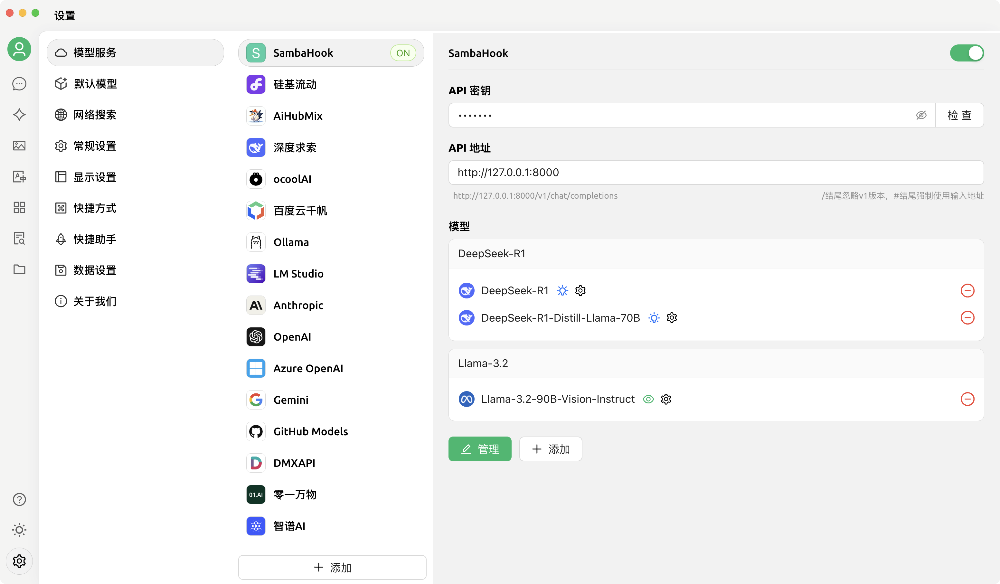

# Samba Hook

将 SambaNova Cloud Playground 转化成本地 API 服务，用于其他 LLM 客户端调用。

## 🚀 快速开始

### 运行

使用 Docker 启动服务：

```bash
docker run -d \
    -p 8000:8000 \
    -e SAMBA_TOKEN=xxx \
    anoyi/samba-hook:latest
```

环境变量说明：

| 环境变量        | 类型   | 默认值 | 必填 | 描述                                      |
| --------------- | ------ | ------ | ---- | ----------------------------------------- |
| SAMBA_TOKEN     | string |        | 否   | SambaNova Cloud Cookies 中的 access_token |
| SAMBA_TOKEN_API | string |        | 否   | 获取 SambaNova Cloud access_token 的API   |

如果不提供 `SAMBA_TOKEN`，则需要提供 `SAMBA_TOKEN_API`，用于获取 access_token。`SAMBA_TOKEN_API` 响应的结果是 access_token 的纯文本。

> 登录 [https://cloud.sambanova.ai/](https://cloud.sambanova.ai/) ，然后打开控制台获取 cookies 中的 access_token。

### API 文档

- Endpoint: `http://127.0.0.1:8000/v1/chat/completions`
- API Key: `无`

**OpenAI SDK 示例**

```python
from openai import OpenAI
client = OpenAI(api_key="----", base_url="http://127.0.0.1:8000/v1")
response = client.chat.completions.create(  
    model="DeepSeek-R1",  
    messages=[    
        {"role": "system", "content": ""},  
        {"role": "user", "content": "计算 111 * 222"}  
    ],  
    temperature=0.7,  
    max_tokens=4096,
    stream=True,
)  
```


### 模型列表

目前支持以下模型：

- DeepSeek-V3.1
- DeepSeek-R1-0528
- DeepSeek-R1-Distill-Llama-70B
- DeepSeek-V3-0324
- E5-Mistral-7B-Instruct
- Llama-3.3-Swallow-70B-Instruct-v0.4
- Llama-4-Maverick-17B-128E-Instruct
- Meta-Llama-3.1-8B-Instruct
- Meta-Llama-3.3-70B-Instruct
- Qwen3-32B
- Whisper-Large-v3

## ❓ 常见问题

### 🍒 Samba Hook x Cherry Studio



在 Cherry Studio 中添加模型提供商：
- 名称 `SambaHook`
- 类型 `OpenAI`
- API 密钥：随便填
- API 地址：`http://127.0.0.1:8000`
- 模型：按上述模型列表添加即可